# Design Document

## Overview

The OSI (Open Supplements Initiative) platform is designed as a comprehensive certification system that creates a chain of trust from raw ingredient sourcing to consumer verification. The platform addresses the critical gap in supplement transparency by requiring manufacturers to provide complete traceability and evidence before receiving cryptographically signed certificates.

**Core Workflow:**
1. **Manufacturer Data Submission** - Complete product data with ingredient sourcing, factory details, lab tests, and scientific literature
2. **Evidence Verification** - OSI staff systematically verify all submitted evidence against accredited standards
3. **Multi-Level Approval** - Structured approval process with digital signatures from authorized reviewers
4. **Certificate Generation** - Cryptographically signed certificates with unique identifiers and QR codes
5. **Public Verification** - Real-time certificate validation accessible to consumers, businesses, and regulators
6. **Ongoing Monitoring** - Continuous monitoring for changes, recalls, and certificate status updates

**Trust Architecture:**
- **Immutable Evidence Chain** - All evidence is cryptographically hashed and linked to prevent tampering
- **Multi-Signature Approval** - Certificates require multiple authorized signatures to prevent single-point fraud
- **Real-Time Validation** - Certificate status can be verified instantly via API or QR code scanning
- **Audit Trail** - Complete history of all changes, approvals, and certificate operations

## Critical System Details

### Digital Signing Process

**Certificate Authority Structure:**
```
OSI Root CA (Offline, Air-gapped)
├── OSI Intermediate CA (Online, HSM-protected)
    ├── Product Certificate Signing Key
    ├── Organization Certificate Signing Key
    └── Reviewer Signing Keys (Individual)
```

**Multi-Signature Approval Process:**
1. **Primary Reviewer** - Technical review and initial approval signature
2. **Secondary Reviewer** - Independent verification and second signature
3. **Authorized Signatory** - Final approval with certificate issuance authority
4. **System Signature** - Automated cryptographic seal with timestamp

**Certificate Generation Process:**
```
1. Collect all approved data and evidence hashes
2. Generate certificate serial number (UUID + timestamp)
3. Create X.509 certificate with OSI custom extensions:
   - Product ID and batch information
   - Evidence hash chain
   - Approval signatures
   - Expiration date (2 years default)
4. Sign certificate with OSI Intermediate CA private key
5. Record certificate hash on blockchain
6. Generate QR code with verification URL
7. Create printable certificate PDF
```

**Signature Verification:**
- **Certificate Chain Validation** - Verify against OSI Root CA
- **Revocation Check** - Check Certificate Revocation List (CRL)
- **Timestamp Validation** - Verify certificate is within validity period
- **Evidence Integrity** - Verify all evidence hashes match original submissions
- **Blockchain Verification** - Confirm certificate hash exists on blockchain

### Database Architecture

**Primary Database (PostgreSQL):**
```sql
-- Core product data with JSONB for OSI structure
CREATE TABLE supplements (
    id UUID PRIMARY KEY,
    osi_data JSONB NOT NULL,
    organization_id UUID REFERENCES organizations(id),
    status VARCHAR(20) NOT NULL,
    created_at TIMESTAMP DEFAULT NOW(),
    updated_at TIMESTAMP DEFAULT NOW(),
    data_hash VARCHAR(64) NOT NULL -- SHA-256 of complete OSI data
);

-- Digital certificates with full PKI data
CREATE TABLE certificates (
    id UUID PRIMARY KEY,
    supplement_id UUID REFERENCES supplements(id),
    serial_number VARCHAR(64) UNIQUE NOT NULL,
    x509_certificate TEXT NOT NULL, -- Base64 encoded certificate
    certificate_hash VARCHAR(64) NOT NULL,
    status VARCHAR(20) DEFAULT 'active',
    issued_at TIMESTAMP NOT NULL,
    expires_at TIMESTAMP NOT NULL,
    blockchain_tx_id VARCHAR(128),
    revocation_reason TEXT,
    revoked_at TIMESTAMP
);

-- Evidence and document tracking
CREATE TABLE evidence_documents (
    id UUID PRIMARY KEY,
    supplement_id UUID REFERENCES supplements(id),
    document_type VARCHAR(50) NOT NULL, -- lab_test, factory_cert, study_doi
    file_path VARCHAR(500),
    file_hash VARCHAR(64) NOT NULL,
    metadata JSONB,
    uploaded_at TIMESTAMP DEFAULT NOW(),
    verified_at TIMESTAMP,
    verified_by UUID REFERENCES users(id)
);

-- Multi-signature approval tracking
CREATE TABLE approval_signatures (
    id UUID PRIMARY KEY,
    supplement_id UUID REFERENCES supplements(id),
    reviewer_id UUID REFERENCES users(id),
    signature_type VARCHAR(20), -- primary, secondary, final
    digital_signature TEXT NOT NULL, -- Cryptographic signature
    signed_at TIMESTAMP DEFAULT NOW(),
    notes TEXT
);

-- Ingredient sourcing and traceability
CREATE TABLE ingredient_sources (
    id UUID PRIMARY KEY,
    supplement_id UUID REFERENCES supplements(id),
    ingredient_name VARCHAR(200) NOT NULL,
    supplier_name VARCHAR(200) NOT NULL,
    supplier_address TEXT NOT NULL,
    factory_name VARCHAR(200) NOT NULL,
    factory_address TEXT NOT NULL,
    batch_number VARCHAR(100),
    manufacturing_date DATE,
    expiry_date DATE,
    certificates JSONB, -- GMP, organic, etc.
    test_results JSONB
);

-- Blockchain ledger for immutable records
CREATE TABLE blockchain_ledger (
    id UUID PRIMARY KEY,
    entity_type VARCHAR(20), -- supplement, certificate, approval
    entity_id UUID NOT NULL,
    transaction_type VARCHAR(30) NOT NULL,
    data_hash VARCHAR(64) NOT NULL,
    previous_hash VARCHAR(64),
    blockchain_tx_id VARCHAR(128),
    block_number BIGINT,
    timestamp TIMESTAMP DEFAULT NOW(),
    gas_used INTEGER
);
```

**Evidence Integrity System:**
```sql
-- Hash chain for evidence integrity
CREATE TABLE evidence_hash_chain (
    id UUID PRIMARY KEY,
    supplement_id UUID REFERENCES supplements(id),
    evidence_type VARCHAR(50),
    current_hash VARCHAR(64),
    previous_hash VARCHAR(64),
    chain_position INTEGER,
    created_at TIMESTAMP DEFAULT NOW()
);
```

### Complete Process Flow

**Phase 1: Manufacturer Registration and Setup**
1. **Company Registration**
   - Legal entity verification (business registration, tax ID)
   - Key personnel identification and credentials
   - Manufacturing facility registration and GMP certification
   - Initial compliance assessment and risk scoring

2. **System Access Setup**
   - User account creation with multi-factor authentication
   - Role assignment and permission configuration
   - API key generation for programmatic access
   - Training completion and certification

**Phase 2: Product Data Submission**
1. **Basic Product Information**
   - Product name, description, and intended use
   - Dosage form and administration route
   - Target market and regulatory jurisdiction
   - Unique product identifier generation

2. **Detailed Ingredient Specification**
   - Complete ingredient list with quantities
   - Botanical/chemical names and common names
   - Supplier information for each ingredient
   - Factory details including addresses and certifications
   - Batch tracking and lot number systems

3. **Manufacturing Details**
   - Manufacturing process description
   - Quality control procedures
   - Facility certifications (GMP, ISO, organic)
   - Equipment validation and calibration records

4. **Evidence Upload**
   - Third-party lab test results (identity, purity, potency)
   - Certificate of analysis for each ingredient batch
   - Factory inspection reports and certifications
   - Scientific literature with DOI links for health claims
   - Regulatory approvals from other jurisdictions

**Phase 3: Evidence Verification and Review**
1. **Automated Validation**
   - OSI JSON schema compliance check
   - Document format and integrity verification
   - DOI link validation and literature access
   - Cross-reference with known databases (banned substances, etc.)

2. **Primary Technical Review**
   - Ingredient safety assessment
   - Manufacturing process evaluation
   - Lab test result verification
   - Literature review for health claims
   - Compliance with regulatory requirements

3. **Secondary Independent Review**
   - Independent verification of primary review
   - Additional literature search and validation
   - Risk assessment and safety evaluation
   - Recommendation for approval or rejection

4. **Expert Panel Review (if required)**
   - Complex products or novel ingredients
   - Controversial health claims
   - Safety concerns or interactions
   - Regulatory compliance questions

**Phase 4: Approval and Certificate Generation**
1. **Multi-Signature Approval**
   - Primary reviewer digital signature
   - Secondary reviewer confirmation signature
   - Authorized signatory final approval
   - System timestamp and seal

2. **Certificate Creation**
   - Generate unique certificate serial number
   - Create X.509 certificate with OSI extensions
   - Include all evidence hashes and approval signatures
   - Set expiration date (typically 2 years)

3. **Cryptographic Signing**
   - Sign certificate with OSI Intermediate CA private key
   - Generate certificate hash for blockchain recording
   - Create QR code with verification URL
   - Generate printable certificate PDF

4. **Blockchain Recording**
   - Record certificate hash on blockchain
   - Create immutable timestamp
   - Generate Merkle proof for verification
   - Update certificate status to "active"

**Phase 5: Publication and Verification**
1. **Public Database Update**
   - Add product to searchable public database
   - Generate unique OSI product number
   - Create public product page with all verified information
   - Enable QR code and API verification

2. **Notification and Distribution**
   - Notify manufacturer of certificate issuance
   - Provide certificate files and QR codes
   - Send regulatory submission package
   - Update all stakeholders

**Phase 6: Ongoing Monitoring and Maintenance**
1. **Continuous Monitoring**
   - Monitor for ingredient source changes
   - Track regulatory status updates
   - Watch for safety alerts or recalls
   - Monitor certificate expiration dates

2. **Change Management**
   - Process ingredient or formulation changes
   - Handle supplier or factory changes
   - Update certificates for significant changes
   - Maintain audit trail of all modifications

3. **Certificate Lifecycle Management**
   - Send renewal notifications before expiration
   - Process certificate renewal applications
   - Handle certificate revocation if needed
   - Maintain Certificate Revocation List (CRL)

### Security and Fraud Prevention

**Multi-Layer Security:**
1. **Identity Verification** - KYC/KYB for all manufacturers
2. **Document Authentication** - Digital signatures on all uploaded documents
3. **Evidence Cross-Validation** - Multiple independent verification sources
4. **Cryptographic Integrity** - Hash chains prevent tampering
5. **Blockchain Immutability** - Permanent record of all certificate operations
6. **Real-Time Monitoring** - Automated fraud detection algorithms

**Fraud Detection Mechanisms:**
- Duplicate submission detection
- Suspicious pattern recognition
- Cross-reference with known fraudulent entities
- Automated lab result validation
- Supply chain verification
- Regulatory database cross-checking

## Architecture

### High-Level Architecture

```mermaid
graph TB
    subgraph "User Interfaces"
        WA[Web Application]
        MA[Mobile App]
        CP[Consumer Portal]
        HP[Healthcare Portal]
    end
    
    subgraph "External Integrations"
        HS[Healthcare Software]
        RS[Regulatory Systems]
        API[Third-party APIs]
    end
    
    subgraph "API Gateway & Security"
        AG[API Gateway]
        AUTH[Authentication Service]
        RL[Rate Limiting]
        SSL[SSL/TLS Termination]
    end
    
    subgraph "Core Platform Services"
        SDS[Supplement Data Service]
        VS[Validation Service]
        SS[Search Service]
        VCS[Version Control Service]
        NS[Notification Service]
    end
    
    subgraph "Digital Certification Authority"
        CA[Certificate Authority]
        CSR[Certificate Signing]
        CRL[Certificate Revocation]
        CV[Certificate Validation]
        KM[Key Management HSM]
    end
    
    subgraph "Web Application Services"
        UMS[User Management]
        OMS[Organization Management]
        WF[Workflow Engine]
        RP[Reporting Service]
        FS[File Upload Service]
    end
    
    subgraph "Data & Storage Layer"
        PDB[(Primary Database)]
        SI[(Search Index)]
        CS[(Certificate Store)]
        FS[(File Storage)]
        CACHE[(Cache Layer)]
        BQ[(Blockchain Ledger)]
    end
    
    subgraph "External Authorities"
        TGA[TGA Australia]
        FDA[FDA USA]
        EMA[EMA Europe]
        HC[Health Canada]
    end
    
    WA --> AG
    MA --> AG
    CP --> AG
    HP --> AG
    HS --> AG
    RS --> AG
    API --> AG
    
    AG --> AUTH
    AG --> RL
    AG --> SSL
    AG --> SDS
    AG --> VS
    AG --> SS
    AG --> VCS
    AG --> NS
    AG --> CA
    AG --> UMS
    AG --> OMS
    AG --> WF
    AG --> RP
    AG --> FS
    
    CA --> CSR
    CA --> CRL
    CA --> CV
    CA --> KM
    
    SDS --> PDB
    SDS --> CACHE
    VS --> PDB
    SS --> SI
    VCS --> PDB
    CA --> CS
    CA --> BQ
    FS --> FS
    
    SDS --> TGA
    SDS --> FDA
    SDS --> EMA
    SDS --> HC
```



### Technology Stack

**Frontend & Web Application**:
- **Web Framework**: React.js with TypeScript
- **Mobile**: React Native for cross-platform mobile apps
- **UI Library**: Material-UI or Ant Design for consistent UX
- **State Management**: Redux Toolkit for complex state management
- **Authentication**: Auth0 or AWS Cognito for user management

**Backend Services**:
- **API Framework**: Node.js with Express.js and TypeScript
- **Microservices**: Docker containers with Kubernetes orchestration
- **Message Queue**: Redis/RabbitMQ for async processing
- **Background Jobs**: Bull Queue for scheduled tasks

**Digital Certification**:
- **PKI Infrastructure**: OpenSSL with Hardware Security Module (HSM)
- **Certificate Standards**: X.509 certificates with custom extensions
- **Blockchain**: Ethereum or Hyperledger for certificate transparency
- **Timestamping**: RFC 3161 compliant timestamping authority

**Data & Storage**:
- **Primary Database**: PostgreSQL with JSONB for OSI data
- **Search Engine**: Elasticsearch for advanced search capabilities
- **Certificate Store**: Dedicated secure storage for certificates and keys
- **File Storage**: AWS S3 or compatible object storage
- **Cache**: Redis for performance optimization
- **Blockchain**: Immutable ledger for certificate audit trail

**Security & Compliance**:
- **Encryption**: AES-256 for data at rest, TLS 1.3 for data in transit
- **Key Management**: AWS KMS or HashiCorp Vault
- **Audit Logging**: Comprehensive audit trails for compliance
- **Compliance**: SOC 2 Type II, ISO 27001 readiness

## Components and Interfaces

### 1. Web Application Platform

**Purpose**: Primary user interface for manufacturers, healthcare providers, and administrators to interact with the OSI platform.

**Key Features**:
- **Manufacturer Dashboard**: Product registration, certification status tracking, document upload
- **Healthcare Provider Portal**: Search certified products, verify certificates, access clinical data
- **Consumer Interface**: Public product lookup, certificate verification, safety information
- **Admin Panel**: User management, system monitoring, compliance reporting

**User Workflows**:
- **Product Registration**: Step-by-step wizard for entering OSI-compliant product data
- **Certification Process**: Guided workflow from application to certificate issuance
- **Document Management**: Upload and manage supporting documents (lab reports, regulatory approvals)
- **Certificate Verification**: Real-time certificate validation and status checking

### 2. Digital Certification Authority (CA)

**Purpose**: Issues, manages, and validates cryptographic certificates that verify supplement product authenticity and data integrity.

**Certificate Types**:
- **Product Certificates**: Certify individual supplement products with OSI data
- **Organization Certificates**: Verify manufacturer/sponsor identity and credentials
- **Data Integrity Certificates**: Ensure OSI data hasn't been tampered with
- **Regulatory Compliance Certificates**: Verify regulatory approval status

**Key Operations**:
```
POST /api/v1/certificates/request - Submit certificate signing request
GET /api/v1/certificates/{id} - Retrieve certificate details
POST /api/v1/certificates/verify - Verify certificate authenticity
GET /api/v1/certificates/revocation-list - Get certificate revocation list
POST /api/v1/certificates/revoke - Revoke a certificate
```

**Certificate Lifecycle**:
1. **Application**: Manufacturer submits product data and supporting documents
2. **Validation**: Automated and manual verification of data accuracy and completeness
3. **Review**: Expert review of clinical claims and regulatory compliance
4. **Issuance**: Digital certificate generation with cryptographic signatures
5. **Publication**: Certificate published to blockchain ledger for transparency
6. **Monitoring**: Ongoing monitoring for data changes or compliance issues
7. **Renewal/Revocation**: Certificate lifecycle management

### 3. Supplement Data Service

**Purpose**: Core service managing supplement data CRUD operations and business logic.

**Key Endpoints**:
```
GET /api/v1/supplements - List certified supplements with filtering
GET /api/v1/supplements/{id} - Get specific supplement with certificate status
POST /api/v1/supplements - Submit new supplement for certification
PUT /api/v1/supplements/{id} - Update supplement data (triggers re-certification)
GET /api/v1/supplements/search - Advanced search with certificate filtering
GET /api/v1/supplements/artg/{artgNumber} - Get by regulatory identifier
GET /api/v1/supplements/{id}/certificate - Get associated certificate
GET /api/v1/supplements/verified - List only certified products
```

**Enhanced Data Operations**:
- CRUD operations with certificate lifecycle integration
- Bulk import/export with certificate batch processing
- Data transformation and normalization with validation
- Regulatory data synchronization from external authorities
- Certificate status tracking and notifications

### 4. Validation & Compliance Service

**Purpose**: Ensures all supplement data conforms to OSI schema and regulatory requirements before certification.

**Multi-Layer Validation**:
- **Schema Validation**: OSI JSON schema compliance
- **Regulatory Validation**: Cross-reference with TGA, FDA, EMA databases
- **Clinical Validation**: Verify health claims against scientific evidence
- **Manufacturing Validation**: Verify GMP compliance and facility credentials
- **Label Validation**: Ensure product labels match registered data

**Compliance Checks**:
- Ingredient safety assessments
- Drug interaction screening
- Contraindication verification
- Dosage safety validation
- Allergen declaration accuracy

### 5. Blockchain Ledger Service

**Purpose**: Provides immutable record-keeping for certificate issuance, revocation, and data integrity.

**Blockchain Operations**:
- Certificate hash recording for tamper detection
- Timestamp anchoring for certificate validity periods
- Revocation list management
- Audit trail for all certificate operations
- Public verification without revealing sensitive data

**Smart Contract Functions**:
- Automated certificate validation
- Compliance rule enforcement
- Multi-signature approval workflows
- Automated renewal notifications

### 6. Organization Management Service

**Purpose**: Manages manufacturer profiles, credentials, and certification eligibility.

**Key Features**:
- **Company Verification**: Legal entity verification and credential checking
- **Facility Management**: Manufacturing facility registration and GMP verification
- **Personnel Management**: Key personnel credentials and qualifications
- **Compliance Monitoring**: Ongoing monitoring of regulatory standing
- **Risk Assessment**: Automated risk scoring based on compliance history

### 7. Workflow Engine

**Purpose**: Orchestrates complex certification workflows and approval processes.

**Workflow Types**:
- **New Product Certification**: Multi-step approval process with expert review
- **Data Update Workflows**: Change management with impact assessment
- **Compliance Monitoring**: Automated monitoring with alert triggers
- **Certificate Renewal**: Automated renewal process with validation checks
- **Incident Response**: Workflow for handling safety issues or recalls

### 8. Integration Hub

**Purpose**: Manages connections with external regulatory authorities and healthcare systems.

**External Integrations**:
- **Regulatory APIs**: Real-time sync with TGA, FDA, EMA, Health Canada
- **Healthcare Systems**: Integration with EMR/EHR systems and clinical software
- **Laboratory Networks**: Integration with testing laboratories for verification
- **Supply Chain Systems**: Integration with manufacturing and distribution systems
- **Pharmacovigilance**: Integration with adverse event reporting systems

**API Endpoints for Healthcare Integration**:
```
GET /api/v1/integration/healthcare/products - Products formatted for EMR systems
GET /api/v1/integration/healthcare/interactions - Drug-supplement interactions
POST /api/v1/integration/healthcare/verify - Bulk certificate verification
GET /api/v1/integration/healthcare/updates - Real-time product updates
```

## Data Models

### Core Data Structure

The platform extends the existing OSI JSON schema v0.2 with certification and trust components:

#### Enhanced Supplement Record
```json
{
  "id": "uuid",
  "osiData": { /* Complete OSI v0.2 JSON structure */ },
  "certification": {
    "status": "pending|under_review|certified|rejected|revoked",
    "certificateId": "uuid",
    "issuedAt": "timestamp",
    "expiresAt": "timestamp",
    "certificateHash": "sha256_hash",
    "blockchainTxId": "blockchain_transaction_id",
    "trustScore": "number_0_to_100",
    "lastVerified": "timestamp"
  },
  "organization": {
    "id": "uuid",
    "name": "string",
    "verificationStatus": "verified|pending|rejected",
    "gmpCertified": "boolean",
    "regulatoryStanding": "good|warning|suspended"
  },
  "workflow": {
    "currentStage": "string",
    "assignedReviewer": "userId",
    "reviewNotes": [],
    "approvalHistory": [],
    "requiredDocuments": []
  },
  "metadata": {
    "createdAt": "timestamp",
    "updatedAt": "timestamp",
    "createdBy": "userId",
    "status": "draft|submitted|active|inactive",
    "version": "semver",
    "dataIntegrityHash": "sha256_hash"
  }
}
```

#### Digital Certificate
```json
{
  "id": "uuid",
  "certificateType": "product|organization|data_integrity|regulatory_compliance",
  "supplementId": "uuid",
  "organizationId": "uuid",
  "x509Certificate": "base64_encoded_certificate",
  "publicKey": "base64_encoded_public_key",
  "privateKeyId": "hsm_key_reference",
  "serialNumber": "certificate_serial_number",
  "issuer": "OSI_Certificate_Authority",
  "subject": "certificate_subject_dn",
  "validFrom": "timestamp",
  "validTo": "timestamp",
  "status": "active|revoked|expired|suspended",
  "revocationReason": "string",
  "blockchainRecord": {
    "transactionId": "blockchain_tx_id",
    "blockNumber": "number",
    "merkleProof": "string"
  },
  "extensions": {
    "osiVersion": "0.2",
    "productCategories": [],
    "regulatoryJurisdictions": [],
    "trustLevel": "basic|enhanced|premium"
  },
  "metadata": {
    "issuedAt": "timestamp",
    "issuedBy": "userId",
    "lastValidated": "timestamp",
    "validationCount": "number"
  }
}
```

#### Organization Profile
```json
{
  "id": "uuid",
  "legalName": "string",
  "tradingNames": [],
  "registrationNumber": "string",
  "jurisdiction": "string",
  "address": {
    "street": "string",
    "city": "string",
    "state": "string",
    "country": "string",
    "postalCode": "string"
  },
  "contacts": {
    "primary": { "name": "string", "email": "string", "phone": "string" },
    "regulatory": { "name": "string", "email": "string", "phone": "string" },
    "technical": { "name": "string", "email": "string", "phone": "string" }
  },
  "verification": {
    "status": "pending|verified|rejected|suspended",
    "verifiedAt": "timestamp",
    "verifiedBy": "userId",
    "documents": [],
    "complianceScore": "number_0_to_100"
  },
  "certifications": {
    "gmp": { "certified": "boolean", "expiresAt": "timestamp", "certifyingBody": "string" },
    "iso": { "certified": "boolean", "standard": "string", "expiresAt": "timestamp" },
    "organic": { "certified": "boolean", "certifyingBody": "string", "expiresAt": "timestamp" }
  },
  "facilities": [
    {
      "id": "uuid",
      "name": "string",
      "type": "manufacturing|testing|storage|distribution",
      "address": {},
      "licenses": [],
      "inspectionHistory": []
    }
  ],
  "regulatoryStatus": {
    "tga": { "status": "good_standing|warning|suspended", "lastChecked": "timestamp" },
    "fda": { "status": "good_standing|warning|suspended", "lastChecked": "timestamp" },
    "ema": { "status": "good_standing|warning|suspended", "lastChecked": "timestamp" }
  },
  "riskProfile": {
    "riskScore": "number_0_to_100",
    "riskFactors": [],
    "lastAssessment": "timestamp",
    "mitigationMeasures": []
  }
}
```

#### Workflow Instance
```json
{
  "id": "uuid",
  "workflowType": "product_certification|organization_verification|compliance_review",
  "entityId": "uuid",
  "status": "active|completed|cancelled|failed",
  "currentStage": "string",
  "stages": [
    {
      "name": "string",
      "status": "pending|in_progress|completed|failed",
      "assignedTo": "userId",
      "startedAt": "timestamp",
      "completedAt": "timestamp",
      "notes": "string",
      "requiredActions": [],
      "documents": []
    }
  ],
  "sla": {
    "targetCompletionDate": "timestamp",
    "escalationRules": [],
    "priorityLevel": "low|medium|high|urgent"
  },
  "metadata": {
    "createdAt": "timestamp",
    "createdBy": "userId",
    "updatedAt": "timestamp"
  }
}
```

#### Blockchain Ledger Entry
```json
{
  "id": "uuid",
  "transactionType": "certificate_issued|certificate_revoked|data_updated|verification_performed",
  "entityId": "uuid",
  "entityType": "supplement|certificate|organization",
  "dataHash": "sha256_hash",
  "previousHash": "sha256_hash",
  "timestamp": "timestamp",
  "blockchainTxId": "string",
  "blockNumber": "number",
  "gasUsed": "number",
  "merkleProof": "string",
  "witnesses": [],
  "metadata": {
    "initiatedBy": "userId",
    "reason": "string",
    "additionalData": {}
  }
}
```

### Enhanced Database Schema Design

**Core Tables**:
- `supplements` - Enhanced supplement data with certification status
- `certificates` - Digital certificates and PKI data
- `organizations` - Comprehensive organization profiles
- `workflows` - Workflow instances and stage tracking
- `blockchain_ledger` - Immutable record of all certificate operations
- `users` - User management with role-based permissions
- `facilities` - Manufacturing and testing facility data
- `documents` - Supporting documents and attachments
- `audit_logs` - Comprehensive audit trail
- `validation_rules` - Configurable validation and compliance rules

**Certificate-Specific Tables**:
- `certificate_revocation_list` - CRL for revoked certificates
- `certificate_chains` - Certificate hierarchy and trust chains
- `hsm_keys` - Hardware security module key references
- `certificate_templates` - Templates for different certificate types

**Workflow Tables**:
- `workflow_definitions` - Configurable workflow templates
- `workflow_instances` - Active workflow executions
- `workflow_stages` - Individual workflow stage data
- `approval_chains` - Multi-level approval configurations

**Integration Tables**:
- `regulatory_sync` - Synchronization status with external authorities
- `api_integrations` - Third-party API connection configurations
- `notification_queue` - Pending notifications and alerts
- `rate_limits` - API rate limiting and usage tracking

**Advanced Indexes**:
- **Certificate Lookup**: Composite indexes on certificate serial numbers and status
- **Blockchain Verification**: Indexes on transaction IDs and block numbers
- **Trust Scoring**: Indexes supporting trust score calculations
- **Workflow Performance**: Indexes optimized for workflow stage queries
- **Regulatory Compliance**: Indexes for regulatory status and jurisdiction queries
- **Full-Text Search**: Advanced text search across all supplement and organization data

## Error Handling

### Error Response Format

All API errors follow a consistent format:
```json
{
  "error": {
    "code": "ERROR_CODE",
    "message": "Human-readable error message",
    "details": {
      "field": "specific field with error",
      "value": "invalid value",
      "constraint": "validation rule violated"
    },
    "timestamp": "2024-01-01T00:00:00Z",
    "requestId": "uuid"
  }
}
```

### Error Categories

1. **Validation Errors (400)**
   - Schema validation failures
   - Business rule violations
   - Required field missing
   - Invalid data formats

2. **Authentication Errors (401)**
   - Invalid API key
   - Expired tokens
   - Insufficient permissions

3. **Not Found Errors (404)**
   - Supplement not found
   - Invalid endpoint

4. **Conflict Errors (409)**
   - Duplicate ARTG numbers
   - Version conflicts
   - Concurrent modification

5. **Server Errors (500)**
   - Database connection issues
   - External service failures
   - Unexpected system errors

### Error Recovery Strategies

- Automatic retry with exponential backoff for transient failures
- Circuit breaker pattern for external service calls
- Graceful degradation when non-critical services are unavailable
- Comprehensive logging for debugging and monitoring

## Testing Strategy

### Unit Testing
- **Coverage Target**: 90% code coverage
- **Framework**: Jest for Node.js services
- **Focus Areas**:
  - Business logic validation
  - Data transformation functions
  - API endpoint handlers
  - Utility functions

### Integration Testing
- **Database Integration**: Test with real PostgreSQL instance
- **API Integration**: End-to-end API testing with real HTTP calls
- **External Service Integration**: Mock external APIs with realistic responses
- **Schema Validation**: Test OSI schema compliance

### Performance Testing
- **Load Testing**: Simulate concurrent users and API calls
- **Stress Testing**: Test system limits and failure points
- **Database Performance**: Query optimization and index effectiveness
- **Search Performance**: Elasticsearch query performance under load

### Security Testing
- **Authentication Testing**: Verify JWT token handling and expiration
- **Authorization Testing**: Ensure proper role-based access control
- **Input Validation**: Test for SQL injection and XSS vulnerabilities
- **API Security**: Rate limiting and abuse prevention

### Data Quality Testing
- **Schema Compliance**: Automated validation against OSI schema
- **Data Integrity**: Cross-field validation and consistency checks
- **Import/Export Testing**: Bulk data operation validation
- **Migration Testing**: Data migration and transformation accuracy

### Test Data Management
- **Synthetic Data**: Generate realistic test supplement data
- **Anonymized Production Data**: Use sanitized real data for testing
- **Test Fixtures**: Maintain consistent test datasets
- **Data Cleanup**: Automated test data cleanup procedures

### Continuous Testing
- **CI/CD Integration**: Automated testing in deployment pipeline
- **Regression Testing**: Automated testing of existing functionality
- **Monitoring Tests**: Production health checks and synthetic monitoring
- **Performance Monitoring**: Continuous performance baseline tracking