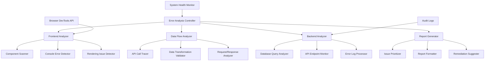

# Design Document

## Overview

The System Error Analysis feature provides a comprehensive full-stack diagnostic tool that systematically identifies, analyzes, and reports errors across the OSI Platform's frontend UI, data flow, and backend systems. The solution leverages existing infrastructure while adding specialized analysis capabilities to detect performance bottlenecks, error patterns, and system reliability issues.

The system builds upon the existing health monitoring infrastructure (SystemHealthDashboard, health routes) and extends it with deep error analysis capabilities. It uses a modular architecture that can analyze different system layers independently while providing unified reporting.

## Architecture

### High-Level Architecture



### Component Architecture

The system consists of four main analysis modules:

1. **Frontend Analyzer**: Scans React components, detects console errors, and identifies rendering issues
2. **Data Flow Analyzer**: Traces API calls and validates data transformations between frontend and backend
3. **Backend Analyzer**: Examines database queries, API endpoints, and server-side error patterns
4. **Report Generator**: Consolidates findings and generates actionable reports with prioritized recommendations

## Components and Interfaces

### Core Analysis Engine

```typescript
interface ErrorAnalysisEngine {
  runFullAnalysis(): Promise<AnalysisReport>
  runFrontendAnalysis(): Promise<FrontendAnalysisResult>
  runDataFlowAnalysis(): Promise<DataFlowAnalysisResult>
  runBackendAnalysis(): Promise<BackendAnalysisResult>
  generateReport(results: AnalysisResult[]): AnalysisReport
}
```

### Frontend Analysis Module

```typescript
interface FrontendAnalyzer {
  scanComponents(): Promise<ComponentIssue[]>
  detectConsoleErrors(): Promise<ConsoleError[]>
  checkErrorBoundaries(): Promise<ErrorBoundaryIssue[]>
  validateStateManagement(): Promise<StateIssue[]>
  analyzeRenderingPerformance(): Promise<RenderingIssue[]>
}

interface ComponentIssue {
  componentName: string
  filePath: string
  issueType: 'missing_error_boundary' | 'unhandled_state' | 'memory_leak' | 'prop_validation'
  severity: 'low' | 'medium' | 'high' | 'critical'
  description: string
  lineNumber?: number
  suggestedFix: string
}
```

### Data Flow Analysis Module

```typescript
interface DataFlowAnalyzer {
  traceAPIRequests(): Promise<APIRequestTrace[]>
  validateDataTransformations(): Promise<DataTransformationIssue[]>
  checkRequestResponseIntegrity(): Promise<IntegrityIssue[]>
  analyzeNetworkErrors(): Promise<NetworkError[]>
}

interface APIRequestTrace {
  endpoint: string
  method: string
  requestTime: number
  responseTime: number
  statusCode: number
  requestPayload: any
  responsePayload: any
  errors: string[]
  transformationIssues: DataTransformationIssue[]
}
```

### Backend Analysis Module

```typescript
interface BackendAnalyzer {
  analyzeDatabaseQueries(): Promise<QueryIssue[]>
  checkAPIEndpoints(): Promise<EndpointIssue[]>
  processErrorLogs(): Promise<LogError[]>
  validateInputHandling(): Promise<ValidationIssue[]>
  checkConnectionPools(): Promise<ConnectionIssue[]>
}

interface QueryIssue {
  query: string
  endpoint: string
  executionTime: number
  errorRate: number
  optimizationSuggestions: string[]
  severity: 'low' | 'medium' | 'high' | 'critical'
}
```

### Report Generation Module

```typescript
interface ReportGenerator {
  generateComprehensiveReport(results: AnalysisResults): AnalysisReport
  prioritizeIssues(issues: Issue[]): PrioritizedIssue[]
  groupRelatedIssues(issues: Issue[]): IssueGroup[]
  generateRemediationPlan(issues: Issue[]): RemediationPlan
}

interface AnalysisReport {
  summary: ReportSummary
  frontendIssues: ComponentIssue[]
  dataFlowIssues: APIRequestTrace[]
  backendIssues: QueryIssue[]
  prioritizedActions: RemediationAction[]
  systemHealthSnapshot: SystemHealthData
  generatedAt: Date
}
```

## Data Models

### Analysis Result Models

```typescript
interface AnalysisResults {
  frontend: FrontendAnalysisResult
  dataFlow: DataFlowAnalysisResult
  backend: BackendAnalysisResult
  systemHealth: SystemHealthSnapshot
}

interface Issue {
  id: string
  category: 'frontend' | 'dataflow' | 'backend' | 'system'
  type: string
  severity: 'low' | 'medium' | 'high' | 'critical'
  title: string
  description: string
  affectedComponents: string[]
  frequency: number
  impact: 'user_experience' | 'performance' | 'security' | 'data_integrity'
  suggestedFix: string
  estimatedEffort: 'low' | 'medium' | 'high'
}

interface RemediationAction {
  priority: number
  category: string
  title: string
  description: string
  steps: string[]
  estimatedTime: string
  relatedIssues: string[]
}
```

### Configuration Models

```typescript
interface AnalysisConfiguration {
  enabledModules: {
    frontend: boolean
    dataFlow: boolean
    backend: boolean
  }
  thresholds: {
    responseTimeWarning: number
    responseTimeCritical: number
    errorRateWarning: number
    errorRateCritical: number
    memoryUsageWarning: number
    memoryUsageCritical: number
  }
  excludePatterns: string[]
  includePatterns: string[]
}
```

## Error Handling

### Analysis Error Management

The system implements comprehensive error handling to ensure analysis can continue even when individual components fail:

```typescript
interface AnalysisError {
  module: string
  operation: string
  error: Error
  timestamp: Date
  recoverable: boolean
}

class AnalysisErrorHandler {
  handleModuleError(error: AnalysisError): void
  logAnalysisFailure(module: string, error: Error): void
  attemptRecovery(error: AnalysisError): boolean
  generatePartialReport(completedModules: string[]): AnalysisReport
}
```

### Graceful Degradation

- If frontend analysis fails, continue with backend and data flow analysis
- If database connection fails, use cached data and log analysis
- If specific components can't be analyzed, document the limitation in the report
- Provide partial results rather than complete failure

## Testing Strategy

### Unit Testing

- **Frontend Analyzer Tests**: Mock React components with known issues, verify detection accuracy
- **Data Flow Analyzer Tests**: Mock API requests/responses, test transformation validation
- **Backend Analyzer Tests**: Mock database queries and error logs, verify analysis logic
- **Report Generator Tests**: Test prioritization algorithms and report formatting

### Integration Testing

- **End-to-End Analysis**: Run full analysis on test environment with known issues
- **Cross-Module Communication**: Verify data flow between analysis modules
- **Error Handling**: Test graceful degradation when modules fail
- **Performance Testing**: Ensure analysis doesn't impact system performance

### Test Data Strategy

```typescript
interface TestScenarios {
  frontendIssues: {
    missingErrorBoundaries: ComponentTestCase[]
    consoleErrors: ErrorTestCase[]
    renderingIssues: RenderTestCase[]
  }
  dataFlowIssues: {
    failedRequests: APITestCase[]
    malformedData: DataTestCase[]
    timeoutIssues: TimeoutTestCase[]
  }
  backendIssues: {
    slowQueries: QueryTestCase[]
    connectionIssues: ConnectionTestCase[]
    validationFailures: ValidationTestCase[]
  }
}
```

### Automated Testing

- **Continuous Analysis**: Run lightweight analysis on every deployment
- **Regression Testing**: Ensure new code doesn't introduce known error patterns
- **Performance Benchmarking**: Track analysis execution time and resource usage
- **Alert Testing**: Verify critical issues trigger appropriate notifications

## Implementation Approach

### Phase 1: Core Infrastructure
- Implement base analysis engine and configuration system
- Create database schema for storing analysis results
- Set up basic error handling and logging

### Phase 2: Backend Analysis
- Implement database query analysis using existing connection pools
- Add API endpoint monitoring and error log processing
- Integrate with existing audit log system

### Phase 3: Frontend Analysis
- Develop component scanning using static analysis
- Implement console error detection using browser APIs
- Add rendering performance monitoring

### Phase 4: Data Flow Analysis
- Create API request tracing using axios interceptors
- Implement data transformation validation
- Add network error analysis

### Phase 5: Reporting and UI
- Build comprehensive report generation
- Create analysis dashboard UI
- Implement automated alerting for critical issues

### Integration Points

- **Existing Health Monitor**: Extend `/api/admin/health` endpoint
- **Audit Logs**: Leverage existing audit_logs table for historical analysis
- **Authentication**: Use existing auth middleware for admin access
- **Database**: Utilize existing PostgreSQL connection and query utilities
- **Frontend**: Integrate with existing Material-UI components and routing